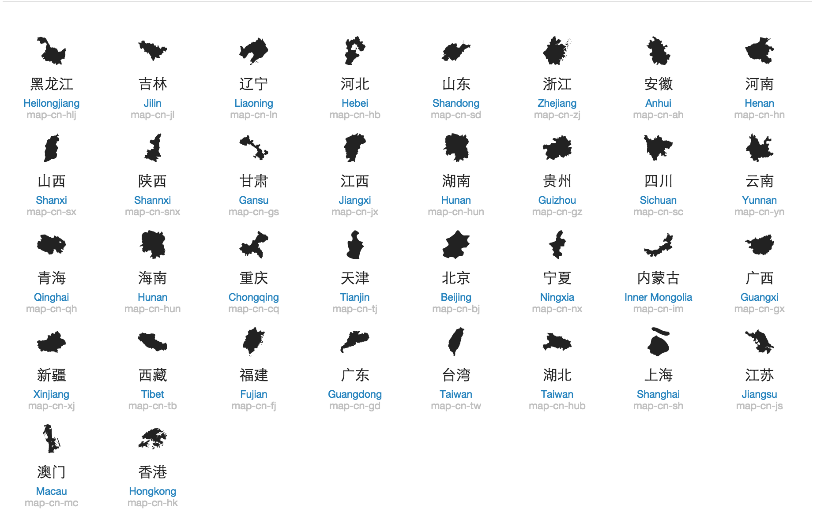

Mapglyphs-China
===============

The CSS Map Font\nFont of China provinces. inspired by the project Map Glyphs from http://mapglyphs.com

You can see the usage guide [here](http://francis-liberty.github.io/blocks/mapglyphs-china/index.html).

Here is the showcase:

